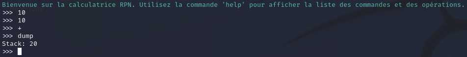
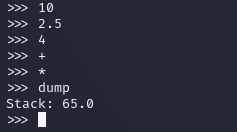
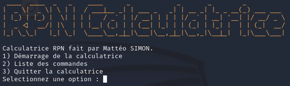
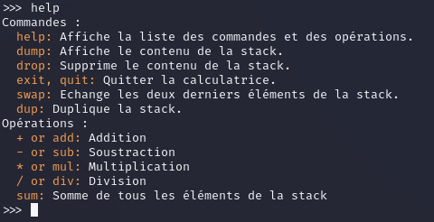

# Calculatrice RPN :

Voici la calculatrice RPN (Reverse Polish Notation). Elle permet d'écrire des formules arithmétiques sans parenthèses.

Dans une calculatrice RPN, vous devez entrer tout d’abord les opérandes, puis les opérateurs, ce qui élimine la nécessité d’utiliser des parenthèses pour définir l’ordre des opérations.

# Getting Start :

Pour utiliser la calculatrice il faut :
  - Télécharger le script rpn.sh et le mettre dans un répertoire.
  - Aller sur le répertoire et mettre les droits sur le fichier.
  - Utiliser la commande ./rpn.sh ou bash rpn.sh pour démarrer le script.

# Exemples :

# Licenses :

Ce projet est sous la licence MIT, celle-ci est disponible dans les fichiers du répertoire [MIT License](./LICENSE.txt).

# Fonctionalités :

Une interface a été mise en place lors du démarrage du script : 

  - Vous pouvez faire des : additions, soustractions, multiplications et des divisions.
  - Vous pouvez manipuler la stack : afficher, supprimer et dupliquer.
  - Avec la commande 'help', afficher les commandes disponibles ainsi que les opérations.

# Avertissements : 

Les commandes sont sensibles à la casse. La commande pour faire une addition est 'add', si vous écrivez 'Add' ou encore 'ADD' il y aura une erreur !

